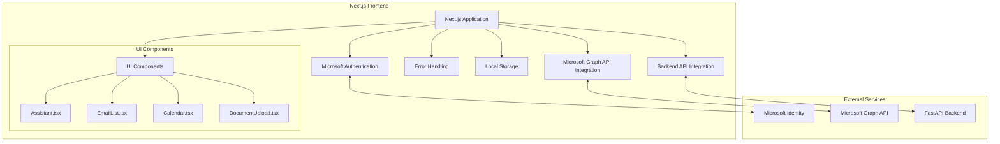
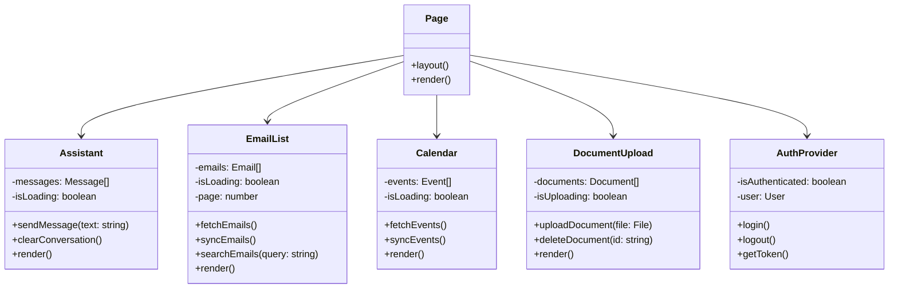
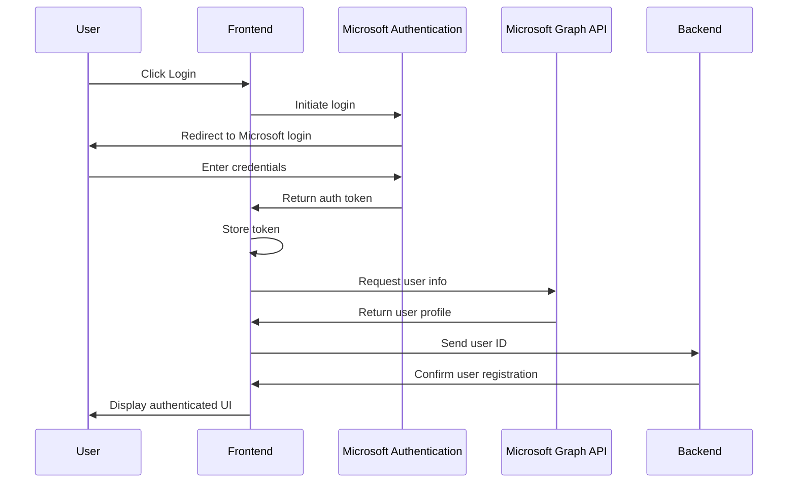
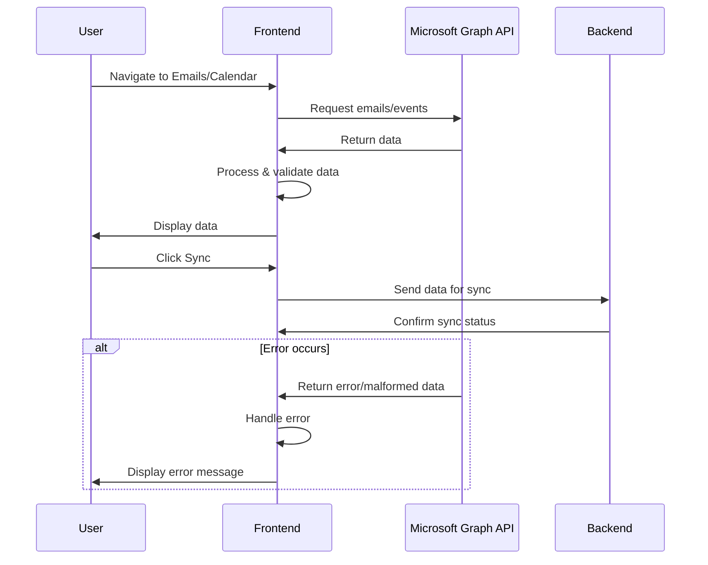
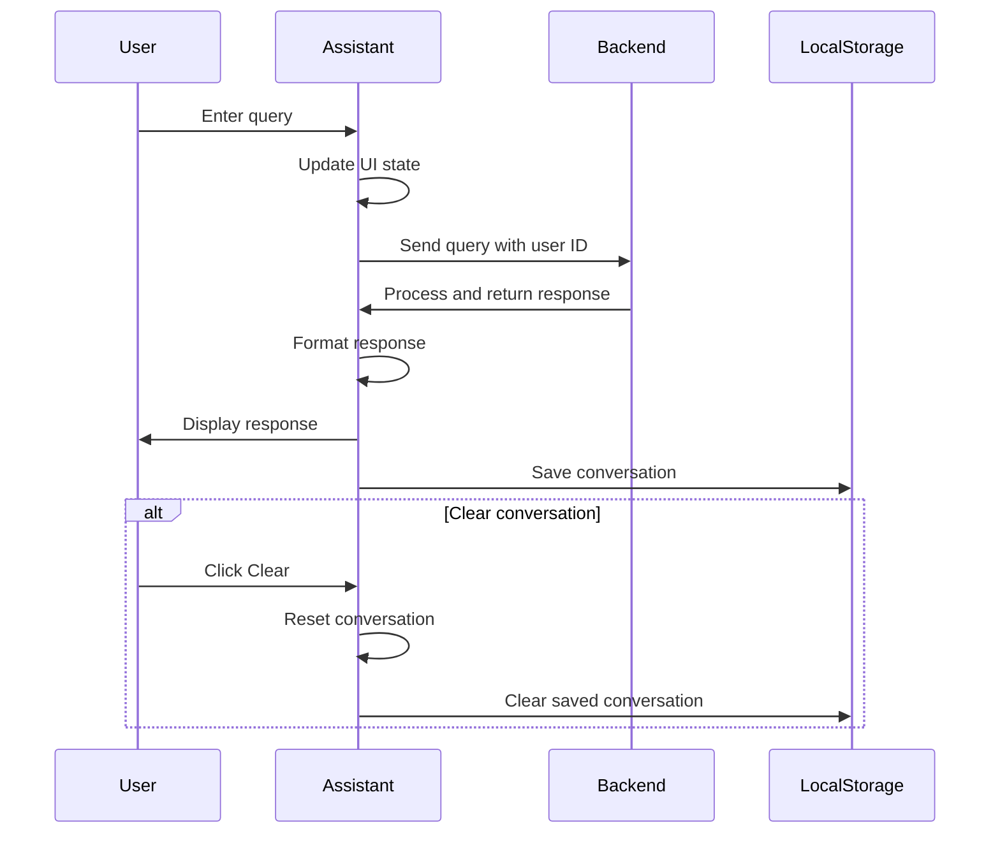
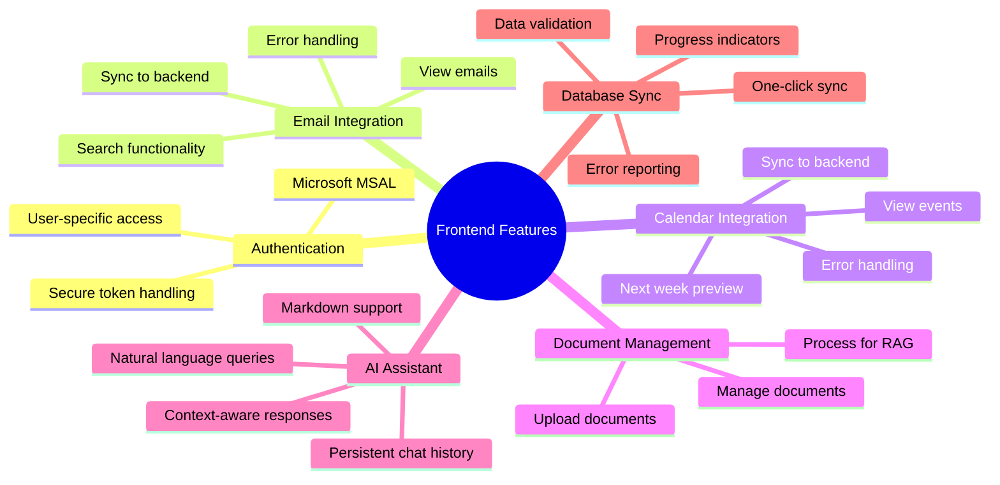
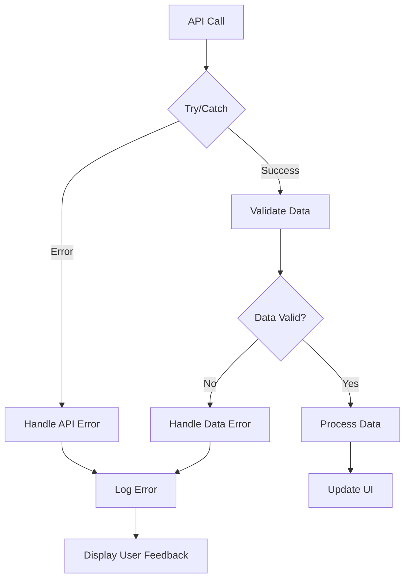
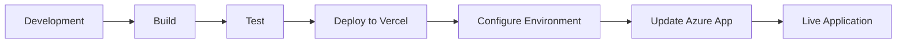
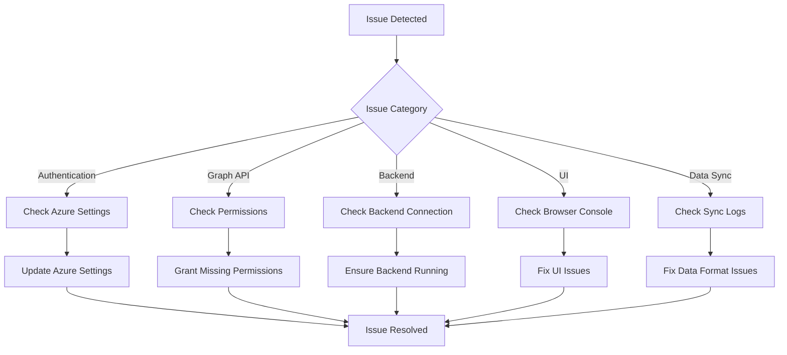

# Next.js Outlook Integration Frontend

This directory contains the Next.js frontend for the Outlook Integration project. It provides a modern web interface for interacting with Microsoft Outlook data and the RAG-powered AI assistant.

## Architecture

The frontend follows a component-based architecture:

1. **Next.js Application**: Provides the React framework and routing.
2. **Microsoft Authentication**: Handles user authentication with Microsoft identity.
3. **Microsoft Graph API**: Retrieves Outlook data (emails, calendar events).
4. **Backend API Integration**: Communicates with the FastAPI backend for RAG queries.
5. **UI Components**: Reusable components for the user interface.
6. **Robust Error Handling**: Comprehensive error handling and data validation.
7. **Local Storage**: Persistent storage for chat history and sync status.

### Architecture Diagram



## Key Components

- `page.tsx`: Main application page with layout and component composition.
- `components/`: Reusable UI components:
  - `Assistant.tsx`: Chat interface for interacting with the AI assistant.
  - `EmailList.tsx`: Display and management of emails.
  - `Calendar.tsx`: Display and management of calendar events.
  - `DocumentUpload.tsx`: Interface for uploading and managing documents.
- `utils/`: Utility functions for API calls, authentication, etc.
- `hooks/`: Custom React hooks for state management and API integration.
- `api/`: API route handlers for server-side operations.

### Component Diagram



## Data Flow

1. **Authentication Flow**:
   - User logs in with Microsoft credentials
   - Application receives authentication token
   - Token is used for Microsoft Graph API calls and backend authentication

2. **Data Retrieval Flow**:
   - Application fetches emails and calendar events from Microsoft Graph API
   - Data is displayed in the UI and synchronized to the backend database
   - Robust error handling ensures data integrity even with incomplete or malformed data

3. **Query Flow**:
   - User enters a query in the Assistant component
   - Query is sent to the backend with the user's ID
   - Backend processes the query and returns a response
   - Response is displayed in the chat interface
   - Chat history is persisted in local storage

### Authentication Flow Diagram



### Data Retrieval Flow Diagram



### Query Flow Diagram



## Environment Variables

| Variable | Description | Default |
|----------|-------------|---------|
| NEXT_PUBLIC_CLIENT_ID | Azure App client ID | - |
| NEXT_PUBLIC_AUTHORITY | Microsoft identity authority URL | https://login.microsoftonline.com/common |
| NEXT_PUBLIC_REDIRECT_URI | Authentication redirect URI | http://localhost:3000 |
| NEXT_PUBLIC_GRAPH_ENDPOINT | Microsoft Graph API endpoint | https://graph.microsoft.com/v1.0 |
| NEXT_PUBLIC_BACKEND_URL | FastAPI backend URL | http://localhost:8000 |

## Features

### Authentication

The application uses Microsoft Authentication Library (MSAL) for user authentication. This provides secure access to Microsoft Graph API and ensures that users can only access their own data.

### Email Integration

- View recent emails with pagination
- Search emails by sender, subject, or content
- Sync emails to the backend database for RAG processing
- Robust error handling for various email formats
- Data validation to handle missing or malformed email data

### Calendar Integration

- View upcoming calendar events with pagination
- View next week's events
- Manage calendar events
- Sync calendar events to the backend database for RAG processing
- Robust error handling for various event formats
- Data validation to handle missing or malformed event data

### Document Management

- Upload documents (PDF, Word, etc.)
- Process documents for RAG
- Manage uploaded documents

### AI Assistant

- Chat interface for natural language queries
- Context-aware responses based on emails, calendar events, and documents
- Suggested questions based on available data
- Markdown formatting support for rich responses
- Persistent chat history using local storage
- Clear conversation option

### Database Synchronization

- One-click sync of all Outlook data to the backend database
- Progress indicators during synchronization
- Detailed error reporting for sync issues
- Automatic data validation and normalization
- Persistent sync status using local storage

### Features Diagram



## Error Handling and Data Validation

The application implements comprehensive error handling and data validation:

- **API Error Handling**: All API calls are wrapped in try/catch blocks with specific error messages
- **Data Validation**: Incoming data from Microsoft Graph API is validated and normalized
- **Default Values**: Missing or malformed data is replaced with sensible defaults
- **User Feedback**: Clear error messages are displayed to the user when issues occur
- **Defensive Programming**: Optional chaining and nullish coalescing operators prevent runtime errors

### Error Handling Flow



## Deployment

### Vercel Deployment

The application is optimized for deployment on Vercel:

1. Connect your GitHub repository to Vercel
2. Configure environment variables in the Vercel dashboard
3. Deploy the application

### Environment Configuration

For production deployment, ensure these environment variables are set:

- `NEXT_PUBLIC_CLIENT_ID`: Your Azure App client ID
- `NEXT_PUBLIC_AUTHORITY`: Microsoft identity authority URL
- `NEXT_PUBLIC_REDIRECT_URI`: Your production URL
- `NEXT_PUBLIC_GRAPH_ENDPOINT`: Microsoft Graph API endpoint
- `NEXT_PUBLIC_BACKEND_URL`: Your production backend URL

### Azure App Registration

For production deployment, update your Azure App registration:

1. Add your production URL to the list of redirect URIs
2. Ensure all required API permissions are granted
3. Configure authentication settings for production

### Deployment Flow



## Running the Frontend

From the project root directory:

```bash
npm run dev
```

This will start the Next.js development server on http://localhost:3000.

## Building for Production

```bash
npm run build
npm start
```

## Troubleshooting

- **Authentication Issues**: Verify your Azure App registration settings and ensure the redirect URI matches your environment.
- **Graph API Issues**: Check that your app has the necessary permissions in Azure AD.
- **Backend Connection Issues**: Ensure the backend server is running and accessible at the URL specified in NEXT_PUBLIC_BACKEND_URL.
- **UI Rendering Issues**: Check browser console for errors and verify that all dependencies are installed correctly.
- **Data Sync Issues**: If synchronization fails, check the browser console for detailed error messages and ensure the backend database is properly configured.
- **Missing Email Data**: Some email providers may return data in different formats; the application includes robust error handling to manage these variations.

### Troubleshooting Flow

